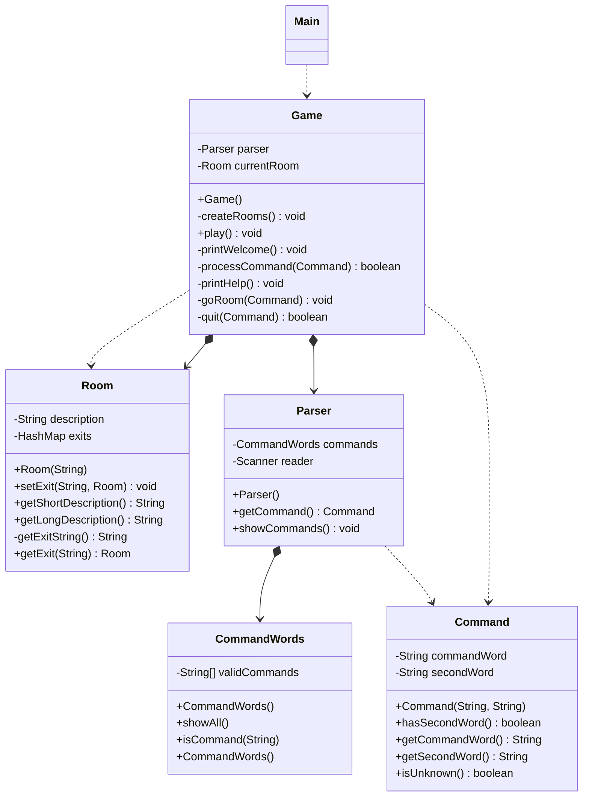

# 实验报告一
## 一.UML类图


## 二.项目代码结构
* Main类是整个游戏的启动入口，启动游戏时就会实例化一个Game类。并调用“play”方法   
* 其次就是Game类，这个类是整个游戏的主类，它创建所有房间，并将它们连接成迷宫；它创建解析器接收用户输入，并将用户输入转换成命令后开始运行游戏。  
* Room类是房间类，可通过该类实例化不同的房间初始化一个Room对象需要一个对当前房间的描述，并通过setExit（）设置出口方向和对应的房间，Room对象还可以根据其它类的需求获取相应的长短描述并返回对应的字符串或者根据对应的方向获取对应的房间  
* Parser类是用来解析用户命令的，读取用户输入并将其解释为“冒险”命令。每次调用它时，它从终端读取一行并尝试将该行解释为一个两个单词的命令。它返回命令作为命令类的对象。其含有一组已知的命令字。它检查用户输入已知的命令，如果输入的不是已知的命令之一，它返回一个标记为未知命令的命令对象。  
* Command类会存储用户输入的命令，并在需要时可以返回两个单词，并且返回命令是否未知。  
* CommandWords类主要功能是提供判断是否为已有的命令，以及输出所有已有的命令类型  
* 其中Parser类对Command类是依赖关系，对CommandWords为聚合关系，这是因为Parser需要CommandWords类所提供的功能，比如说判读命令是否是合法的命令，直观感受就是Parser含有CommandWords对象，而类Parser要完成某个功能引用了类Command，所以为依赖关系，比如说在getCommand()函数中，最后我必需要返回一个Command对象，直观体现为类Parser的某个成员函数的返回值为类Command。  
* Game类对Parser类和Room类为聚合关系，理由同上Game需要Parser类和Room类所提供的功能，Game类需要Parser对象来解析用户输入的命令，需要Room对象表示用户当前所在的房间，直观感受就是Game类含有Parser类和Room类的对象，Game类对Command类为依赖关系，因为processCommand(Command)等函数依赖Command对象来完成对应的命令解析，如果没有Command对象，这个功能显然无法完成，  goRoom(Command) 和quit(Command)函数也是同理  

## 三.改进功能实现
问题一:在Game类的processCommand()方法中，当用户输入的命令被辨认出来以后，有一系列的if语句用来分派程序到不同的地方去执行。从面向对象的设计原则来看，这种解决方案不太好，因为每当要加入一个新的命令时，就得在这一堆if语句中再加入-个if分支，最终会导致这个方法的代码膨胀得极其臃肿。如何改进程序中的这个设计，使得命令的处理更模块化，且新命令的加入能更轻松?请描述你的解决思路，并对你的解决方案进行实现和测试。
```
if (commandWord.equals("help")) {
    printHelp();
}else if (commandWord.equals("go")) {
    goRoom(command);
}else if (commandWord.equals("quit")) {
    wantToQuit = quit(command);
}
```
解决方法：我使用了枚举，我在枚举里面定义一个抽象方法，每种类型对应各自的具体实现。这样在下次添加命令时就不再需要添加if-else语句，我们就可以直接在枚举中添加一个新的类型后直接使用，使用时只需要通过对应的输入找到枚举中对应值的apply函数即可
```
    public enum CommandEnum {
        GO("go") {
            @Override
            public Object apply(Command command,Game game) {
                if(!command.hasSecondWord()) {
                    // 如果没有第二个单词，就不知道到哪去
                    System.out.println("Go where?");
                    return false;
                }
                String direction = command.getSecondWord();

                // 试着根据方向离开当前的房间。
                Room nextRoom = game.currentRoom.getExit(direction);

                if (nextRoom == null) {
                    System.out.println("There is no door!");
                }
                else {
                    game.currentRoom = nextRoom;
                    System.out.println(game.currentRoom.getLongDescription());
                }
                return false;
            }
        },
        HELP("help") {
            @Override
            public Object apply(Command command,Game game) {
                System.out.println("You are lost. You are alone. You wander");
                System.out.println("around at the university.");
                System.out.println();
                System.out.println("Your command words are:");
                game.parser.showCommands();
                return false;
            }
        },
        QUIT("quit") {
            @Override
            public Object apply(Command command,Game game) {
                if(command.hasSecondWord()) {
                    System.out.println("Quit what?");
                    return false;
                }
                else {
                    return true;  // 表示想要退出
                }
            }
        };

        public abstract Object apply(Command command,Game game);
        private String type;
        CommandEnum(String type) {
            this.type = type;
        }

        public String getType() {
            return type;
        }

    }

    //解决问题后的方法调用
    wantToQuit=(Boolean)CommandEnum.valueOf(commandWord.toUpperCase()).apply(command,this);

```

问题二：在Game类的createRooms()函数中，反复使用了多次setExit函数，无疑在我们加入多个出口时，这显然是很不方便的，需要进行改进

```
outside.setExit("east", theater);
outside.setExit("south", lab);
outside.setExit("west", pub);

theater.setExit("west", outside);

pub.setExit("east", outside);

lab.setExit("north", outside);
lab.setExit("east", office);

office.setExit("west", lab);

```
解决方法是在Room类中加入一个setAllExit()函数，这样我们就可以一次性设置一个房间的所有出口，这样相比较于上面的方法更加便捷。
```
//函数setAllExit()可以一次放入所有方向出口
public void setAllExit(Room eastRoom,Room westRoom,Room northRoom,Room southRoom)
{
    exits.put("east", eastRoom);
    exits.put("south", southRoom);
    exits.put("west", westRoom);
    exits.put("north", northRoom);
}

//简化后代码
outside.setAllExit(theater,pub,null,lab);
theater.setAllExit(null,outside,null,null);
pub.setAllExit(outside,null,null,null);
lab.setAllExit(office,null,outside,null);
office.setAllExit(null,lab,null,null);
```

## 四.实验小结
通过本次实验，我主要了解了软件代码规范的重要性，包括在代码中添加javaDoc注释，使用checkStyle检查代码规范等等，这些在以前的代码开发过程都是没有遇见过的，同时还掌握了基于Git的个人代码版本维护方法以及MarkDown文件编写方法。给我印象比较深刻的是在改进功能实现中，一开始没有很好的头绪，但进行查阅资料后发现有多种方式可以实现，包括反射，策略模式以及枚举等等，最后，选择使用枚举的方式实现对应的内容，完成代码的改进。
